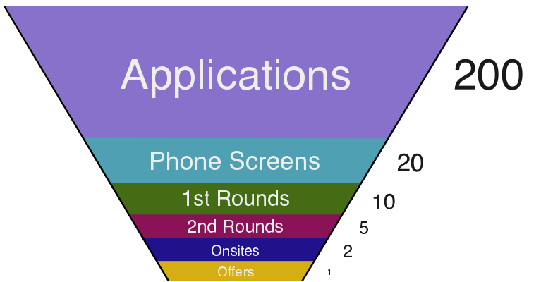
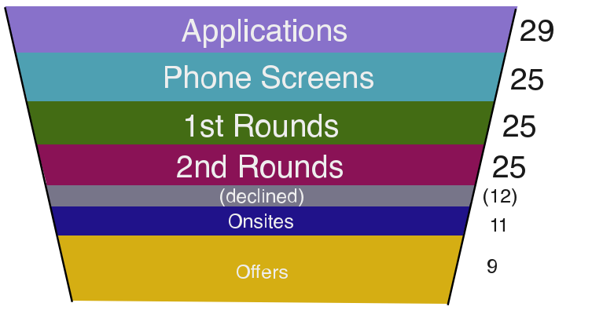
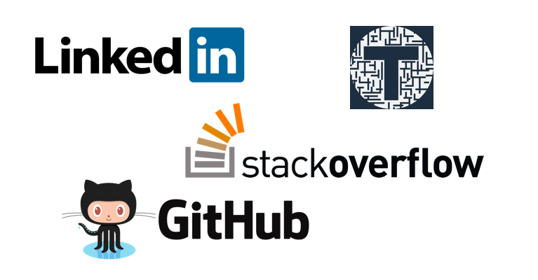
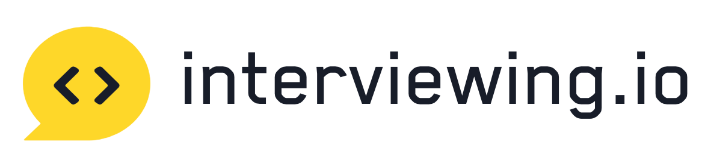
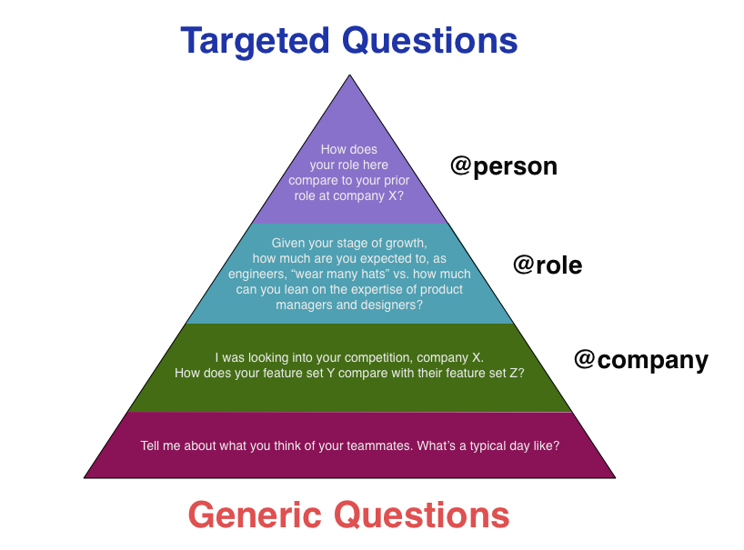
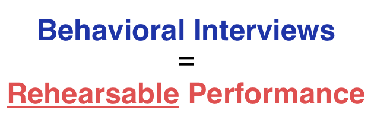

Despite the demand for software engineers, almost every blog post you read about a candidate’s recruitment experience comes with a funnel breakdown that looks something like the above.

That aligned well with my personal experience: before 2019, I had attempted the tech interview circuit four times. Twice for internships while in college, twice for full time positions in the first two years of my career. And my funnel looked much the same.

But here’s what happened during my fourth attempt, 2.5 years into my professional career:



All in all, I spent over **90 hours** of live time in interviews over **120 total interviews** — including phone screens, onsite interviews, etc.

I began studying in early January, started applying in late January, had my first offer on March 12, and signed on March 29.

The nine offers came from startups that either topped my list of “dream jobs” from the beginning, or rose to the top during the interview process. I only accepted onsite interviews if I thought there was a genuine chance I would sign with each particular company.

Those offers were from Palantir, Stripe, Flexport, Grammarly, Checkr, Gusto, Atrium, and Alloy.ai.

 Stay tuned!")

I’m going to dive into the observations, tactics, and advice I’m taking away from my experience here in the hope that you can build a similarly successful funnel in your next job search — especially if you, like me myself a few months ago, consider yourself a solid engineer who is simply “bad at interviewing.”

Before I do that, let’s make sure we’re on the same page.

## Exploring all these companies ensured me I was making the right choice

Up front:

*   I wasn’t optimizing for compensation.
*   I didn’t know exactly what kind of company I wanted, I just knew I wanted to live in San Francisco and try a “mid-sized” startup.
*   I had no prior experience with mid-sized startups.

So the only way I could feel confident about my final decision was if I felt I had thoroughly explored a breadth of companies — had seen their offices, had spent time with their people, and seen what the compensation/risk tradeoffs were across each stage of growth that could qualify as mid-sized in my broad definition of the term.

If you don’t align on these high-level goals, you probably don’t need nine offers from SF startups.

If you just want some negotiation leverage while applying to your dream company, one or two competing offers should get the job done.

If you want to be the highest paid engineer in the Bay Area, apply to FAANG and be done with it.

And I completely acknowledge all the well-documented issues regarding bias in tech recruiting. Everything from sexism to racism to educationism — they exist, and I don’t mean to suggest that following my lead would make all of them go away.

Even if you don’t share my exact goals or background, my hope is to present you with some ideas and tools that will put **you** in a better position than **you** would be had you not read this.

I’m keeping these tips and tricks short for the sake of this post’s brevity. **Look out for more detailed posts from me by** [**subscribing here**](https://tadasant.com/subscribe/)**.**

Onto the secret sauce!

## Polish your professional “social media” presence

Do you have a professionally-taken LinkedIn profile picture?

Is your GitHub just a hot mess of unfinished side projects?

Do you consider yourself a web developer, but don’t have a personal website? 

Do you just read StackOverflow, or have you taken a few hours to create that public record of your depth of knowledge in some specific piece of tech?



**Why this is important:** Yes, none of this fluff has anything to do with how good of an employee you would be. But this is your first impression. The first impression you give before a recruiter will even get on the phone with you.

[First impressions are so heavily weighted](https://www.psychologytoday.com/us/blog/am-i-right/201302/the-power-first-impressions) in our perceptions of people that you should do everything you can to knock this out of the park because it sets the baseline for the rest of your interactions with each company.

## Avoid sending cold applications

Cold applications don’t work for a number of reasons. For one, it’s typically completely opaque as to whether or not a company even reads cold applications. If they do read them, it could be on any kind of random timeline — one that might leave them responding to you weeks after you’ve already signed another offer.

The biggest issue with cold applications is that you are a complete stranger passively submitting an inquiry, where the busy person on the other end is trying to evaluate you based on a page of text (your resume).

They don’t even know if you’re a real person, much less a qualified candidate.

The best companies have an overwhelming number of these come in on a daily basis. The internal recruiting teams can’t keep up with every single application that comes in, and a cold application is always going to drop in priority relative to other recruiting funnels.

Given the ineffectiveness of cold applications, the best alternatives are direct referrals, second-degree (friends of friends) referrals, cold (stranger) referrals, and recruiters and platforms.

I’ll do a deeper dive on what these mean and how to use them in a future post.

**Why this is important:** There is a neat parallel here with the world of internet marketing. Notice how when you click an ad or stumble across some interesting website, they rarely ask you to “buy now!” right up front. They’ll pepper you with some lead magnets, beg you for an email address, lure you in with a free trial.

Eventually, one of their marketing emails will hit you with the upsell. At that point, you’ve read their free content, you like their personality, and you’re more than willing to fork over your cash for that new product.


Sending a cold application is like slapping a big “buy now” button in front of someone as your first impression. After all, replying to your cold application means you’ll be taking a bunch of time slots on peoples’ calendars for the foreseeable future.

Maybe they’ll click “buy now” anyway if your offer is _really_ compelling, but they probably have enough on their plate that they’ll turn around and look for what they need from “warmer” sources first.

## Be a full-time interviewee

This tip was probably the most effective tactic I adopted. I realize that it is, regrettably, not a practical option for many people.

But if you’re a good engineer that will inevitably land _some_ decent job, and can stomach living off of savings for 1–2 months while you commit to the job search process, those thousands of foregone salary will likely pale in comparison to the bumps you get for

1.  The typical [“job hopping”](https://www.forbes.com/sites/lizryan/2018/04/21/yes-you-do-have-to-change-jobs-to-get-paid-what-youre-worth/) bump.
2.  Doing exceptionally well on interviews that your new employer will value you higher than they would otherwise.
3.  The potential signing bonus, which should be even higher than it would be otherwise if you’ve thoroughly impressed the company.

 is $10k. Baseline signing bonus is $10k. Signing bonus for being exceptionally prepared / negotiating multiple offers is $20k.")

**Why this is important**: Being a full-time interviewee is such a drastic move that very few candidates actually take that leap of faith and do it. And while job hunting in tech, especially in SF, isn’t a strictly zero-sum competition (where one candidate being hired means would mean no spots for others), your interview performance is still compared and benchmarked against other interviewees.

So if you come into an interview having all those hours of prep that other candidates don’t — you’re inevitably going to stick out as exceptional — assuming you have the real engineering skills to back it up.

## Do a dozen mock interviews

If you’re anything like me, having a stranger peering over your shoulder and judging your every thought process as you perform a creative activity like coding is a nerve-wracking experience.

No matter how many timed practice problems you’ve done, all that prep could go to waste if you get caught deer-in-the-headlights in that unnatural, pressure-filled environment.

And the best way to conquer this is simple: _practice_.



**Why this is important:** Doing mock interviews is not the same as practicing the mechanics of data structures and algorithms. It is an entirely different skill: _the ability to stomach being live-judged by a stranger on your coding ability._ 

Your ability to do so — an ability you can easily build with a bunch of deliberate practice — will prevent you from freezing up when coding, will help you to recover after making a mistake that would otherwise snowball into a bombed interview, and will ease those pesky butterflies in your stomach that you feel right before you hop on those calls.

## Deliberately exhibit good engineering skills during coding interviews

At first glance, a coding interview appears to have one goal: come up with a sensible, understandable solution to the problem at hand. And that’s what we put most of our time into prepping for with all those data structures and algorithms practice problems.

But don’t skip the last step! You need to wrap your “domain” (data structures and algorithms) knowledge with sound engineering skills. This means you need to check a bunch of boxes on the interviewer’s mental grading rubric as you step through the contrived interview problem.

```javascript{numberLines: true}
function doInterview({writingDryCode, testing, communication, namingVariables}, dataStructures, algorithms) {
  exhibitSkill(writingDryCode)(algorithms.DYNAMIC_PROGRAMMING);
  exhibitSkill(testing)(dataStructures.BINARY_TREE);
  exhibitSkill(communication)(algorithms.BREADTH_FIRST_SEARCH);
  exhibitSkill(namingVariables)(dataStructures.CLASSES);
}

doInterview({...MY_SKILLS}, dataStructures, algorithms);
```

**Why this is important**: Coding interviews have a bad reputation because of everyone’s incessant focus on their domain: data structures and algorithms. If you do your deep dive into learning these data structures and algorithms only to ignore what makes you a good engineer in the first place, you likely won’t make a favorable impression on your interviewer.

The catch is that “good engineering” isn’t easy to come across in the contrived interview setting. It’s perfectly possible to solve these small problems without production-quality engineering skills. If you identify what these skills are, and practice the art of exhibiting them in short, 30–90 minute interview settings, you’ll be checking all the boxes and pass with flying colors — even when you fail to “solve” the problems!

## Overprepare for every call and meeting

Almost every interview is going to end with the classic question, “Do you have any questions for me?”

You should _always_ have a prepared response to this. Ideally, you have a list of questions crafted _for that specific person_ — i.e. questions that wouldn’t make sense to ask anyone else at the company, or anyone else at any other company. 

Second-best are questions that are crafted _for that specific company_ or for someone _in that specific role_.

Least good, but better than nothing, are generic questions like “Tell me about your work” or “Describe team culture.”



**Why this is important**: From what I can tell from feedback I’ve gotten, an interviewer might draw two conclusions from this Q/A interaction:

1.  The candidate is deeply, genuinely interested in our company and what we’re doing; s/he _really_ wants to work here
2.  The candidate exhibits critical thinking skills that might be useful beyond the typical responsibilities associated with an engineer (which could be a big deal for startups that require engineers to wear a lot of hats).

If they’re on the edge of a pass/fail grade for your interview, this interaction could tip it in the positive direction. If the Q/A is an extremely positive interaction that goes on for a few minutes, you can count on [the serial-position effect](https://en.wikipedia.org/wiki/Serial-position_effect) to influence your interviewers’ final perception of you when they come to the team debrief table at the end of a long day.

## Rehearse your answers to behavioral questions out loud

Cracking The Coding Interview’s “Interview Grid” is a great starting point for preparing for behavioral interviews.

The other useful thing I did was collate a bunch of “Behavioral Interview Questions” lists (to the tune of a couple hundred questions) and write down a couple of bullet points of potential answers for each one.

While taking the time to deliberately think through these questions should prevent you from totally bombing any interview questions, it offers little by way of ensuring a performance that is ostensibly thoughtful and thorough. Think back on the life stories you tell your friends in social settings: the first time you told them, you probably botched the punch lines. By the fifth time a year later, you were a stand-up comedian.

Same goes for interviews. Rehearsing by doing real interviews can work, but take it a step further and rehearse Q/A out loud in your own, curated environment to truly refine the skill.



**Why this is important**: [One of the core ingredients to putting on a good performance](https://www.amazon.com/Steal-Show-Interviews-Deal-Closing-Performances-ebook/dp/B00NKQLDMU)— say a speech or a skit — is rehearsal. No matter how good you already are, you would be much, much better if you took the time to rehearse. 

An interview, especially a behavioral one where the questions are predictable, is nothing more than a performance. Prepare for it like one, and passing behavioral interviews will become a walk in the park.

* * *

These tips aren’t a magic bullet that will get you from zero to a dozen offers. You still need to be an excellent engineer. You still could run into issues of bias that will make the journey harder for you than it is for others. You’ll still have bad days.

And nobody’s perfect: Airtable, Plaid, Scale, and Versal’s rejection emails made sure to remind me of that.

If you’re interviewing: best of luck! If you’re not: hope you enjoyed the read anyway :)

As noted above, I plan to write more detailed dives on each of these tips in “how-to” fashion. [Subscribe to my few-times-a-year mailing list](https://tadasant.com/subscribe/) to be the first to know when they’re out there!

* * * 

_A huge thank you goes out to everyone who spent time with me throughout the recruitment process. My old friends and mentors for their moral support and advice, the new friends that came about, and most of all the amazing people I was fortunate to be able to meet and connect with along the way._

* * *

_If anyone has specific questions about my experience with any of these companies or wants to drop me a line, feel free to shoot me an email at tadas [at] tadasant.com!_
