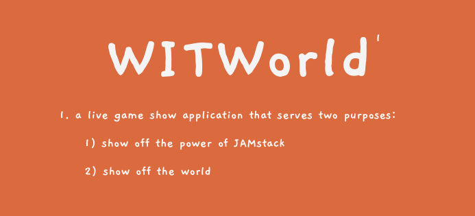
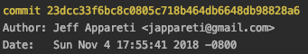

## Question: What can you do with the following?

* Saturday + Sunday
* **16 hours** of brainstorm, design, and dev time
* **4 strangers** who met at breakfast on Saturday morning
* Hacking space, free food, and a slew of hackathon goodies from the organizers of
the [freeCodeCamp/Netlify JAMstack 2018
Hackathon](https://medium.freecodecamp.org/winners-from-the-2018-freecodecamp-jamstack-hackathon-at-github-2a39bd1db878) hosted at
**GitHub**

## Answer: A functional live game show application on the web.

* Built on the backs of at least **18** significant free pieces of software
(conservative estimate)
* About **80 concurrent players** in the live final demo
* **$4** total expenses (for a domain name)
* **One $500 grand prize** from among the **28 teams** and hundreds of
participants with submissions

The final pitch for WITWorld by team Where In The World:

> *“Game show” web application that presents curated photos of images from
> somewhere in the world to a live, participating audience. In each game, the
audience is asked to pin the location where the photo was taken on a map. The
closer a player is to the actual location, the higher on the leaderboard they
place.*

[See the repository here.](https://github.com/tadasant/where-in-the-world)

*****

The term “**static site**” comes with a lot of baggage. It feels like a relic of
the early days of the internet, when static web pages were considered to
“display the same information for all users, from all contexts” — phrasing that
still sits on Wikipedia’s [Static web
page](https://en.wikipedia.org/wiki/Static_web_page) entry as of this writing.

So when we say that the the fundamental foundation of a
[JAMstack](https://jamstack.org/) application is that it is centered around a
static website, that’s sure to raise a lot of eyebrows. After all, the
personalized, information-laden nature of today’s web seems to suggest static
web pages to be a nonstarter.

That mindset has led to a proliferation of full stack developers. Bootcamps and
curriculums all over preach the necessity of full stack skillsets like MERN
(Mongo, Express, React, and Node).

There’s certainly value to such an approach — but there *is* another way.

Enter JAMstack. Its mission: **empower the front-end engineer**.

Better performance. Higher security. Easy scaling. All with just JavaScript,
API’s, and Markup.

The need to learn a full stack of technologies like MERN to be able to produce
valuable, technical apps is in the past. The vast majority of business use cases
don’t need you re-inventing the wheel on the backend. Authentication is a solved
problem. Accepting payments is a solved problem. And so on: you can focus on
becoming a CSS and JavaScript wizard to build your app and slap together tried,
true, and secure API’s to fill in the gaps.

Every new API brings about a world of new use case possibilities — each more and
more dynamic than the last.

And indeed, team Where In The World set out to showcase exactly those
possibilities.

## Showing off JAMstack, and showing off the world

Yes, that’s our cheesy slogan for what WITWorld brings to the table.

As [Jeff](https://www.jeffappareti.com/), [Tyler](https://twitter.com/TJVickOH),
[Gabe](https://twitter.com/GabeGreenfield), and I met over breakfast (thank you,
GitHub, for the bottomless supply of delicious goods), we spitballed ideas for
what we could work on.

> *Here’s one. It’s one of those ideas that’s going to be either really good, or
> really, really bad. Do you guys know HQ Trivia? …*

Right after the post-breakfast keynote ended, Jeff whispered to us:

> *Hey let’s call it “Where In The World”*

And we were off to the races.

## At a hackathon, you’re building to demo

One of the best decisions we made early on was to pick our North Star, cut the
fat, and focus singularly on one goal. That goal — as it should be in most every
hackathon — was: let’s build the steps we need for the demo. Nothing more,
nothing less.

That means this will not be a production-ready application. It means our API
keys are hardcoded into our client side code. It means our app blows up if any
one of the players decides to hit the “Back” button on their browser. The CSS
spacing is off. Our color pallet was a week late for Halloween. Spaghetti, but
it works? Shipped it.

[Our repository is publicly
available](https://github.com/tadasant/where-in-the-world), but please, please
don’t look at our code. It’s a mess and a half. The fact that our last commit
came in at 5:56PM when the code complete deadline was 6:00PM says enough.

## With JAMstack, we sit on the shoulders of giants

Early on, we had a rough idea for how WITWorld would technically come into
being. It was clear that GraphQL subscriptions would have to be at the core of
it: sockets were the best way to make a “live” web app, and GraphQL has neatly
packaged the concept into a “**subscription**”.

Just one problem: none of us had ever written a GraphQL subscription before.

[Hasura](https://hasura.io/) to the rescue.

Hasura provides “a GraphQL server and event triggers over a Postgres database in
minutes” and was one of the hackathon’s sponsors. Converting our app from the
typical read-write push-pull model into realtime over websockets was a matter
of, in the words of Hasura’s documentation:

> *You can turn any query into a subscription by simply replacing `query` with
> `subscription` as the operation type.*

And a few lines of Apollo config to pop in Hasura’s convenient web socket
endpoint.

That’s just one example. We experienced this simple “2 lines of code and XYZ
major feature is ready to go” paradigm over and over again:

* Facebook’s `create-react-app` gave us a full, production-ready webapp scaffold
with a few command line calls
* Deploying that app to a worldwide CDN on [Netlify](https://www.netlify.com/) was
a matter of clicking around a pretty UI
* The combination of [Apollo](https://www.apollographql.com/) and the
[GraphQL](https://graphql.org/) spec meant that a clear standard existed for
every kind of data operation from the client side
* `styled-components` kept the (admittedly lacking amount of) CSS in our app
easy-to-use and modular
* [Google Maps API](https://cloud.google.com/maps-platform/) meant we had an
interactive world map integrated into our app after an hour of reading its docs
* [Netlify’s Functions](https://www.netlify.com/docs/functions/) — an abstraction
over AWS Lambda — gave us a perfect place to centralize our “gamemaster”
operations, critical for a smooth demo

Not to mention all the little FOSS npm libraries we used so that we didn’t spend
too much time figuring out what latitude and longitude actually mean, among
other pieces of glue.

Let’s not forget how much work has gone into modern browsers like **Chrome** and
**Firefox**, or the people responsible for the **Netlify-Slack webhooks** that
alerted us every time our build failed, or the industry-shifting presence of
**React** itself. Even tools like **Heroku** that we touched for a single click
to deploy a Hasura instance — it’s a testament to how impressive they are that
they operate so smoothly with us hardly realizing their major role.

The best part: **none of the above costs a single dollar to use**. Not on the
scale of a hackathon anyway.

## Above all, we were lucky

 Tadas, Gabe, Jeff, and Tyler. GitHub’s Octocat was evidently watching over us.")

For the rest of the weekend, had any one of these scenarios not fallen our way,
we probably wouldn’t be talking much about WITWorld today:

* 2 minutes before we went up to present the final demo, Tyler discovered **a bug
in our presentation setup** that would have kept running the same picture for
every game. A minute later, he had diagnosed and repaired it.
* Our app was (is) full of **security holes** and bugs. Someone could have wiped
our database in two seconds time during any of the demos.
* We happened to pick **a team name that starts with “W”**. This meant we had the
good fortune to do the judging interview last, and the final presentation last.
With the whole process being a time crunch, every minute of extra preparation
was valuable.
* Remember your randomly-selected college roommate? Probably a 50/50 chance it was
a terrible experience. And then there’s us: 4 strangers who miraculously
survived the weekend **without a single disagreement**.
* Our broad range of skills and abilities meant we **never got stuck** on any
particular development problem for more than a short period of time before
someone stepped in and quickly repaired issues they had at some point run into
in their own line of work. Hackathon projects are well known for blowing up
because of some pesky bug that nobody can figure out for hours — we somehow
dodged all of that.
* We’d never tested our app with more than a handful of people before we got up on
stage to handle 70+. Our belief that Heroku could handle that many websocket
connections on its free tier was **blind faith**.

I could go on. The weekend was a roller coaster, and yet time and time again,
things just fell into place.

## WITWorld will hang around as an open source project

As we don’t have concrete plans for the future of WITWorld, the immediate future
will see us cleaning up the codebase, setting up an MIT license and some
structured Issues, and pushing it to the point of being a reasonable public
showcase of JAMstack technology.

Contributors of all skill levels are more than welcome! We’d love to keep you in
the loop whether you want to contribute or just follow any progress. [Join the
mailing list](http://eepurl.com/dNYsno).

## JAMstack is being ushered in by one hell of a community

In the early 2000’s, you needed to buy your own server rackspace to put up a
website. AWS and other cloud providers had turned that concept on its head by
2010. Today, we’re in the next stage of that evolution: you don’t need a backend
or DevOps expert to spin up your next app idea. Netlify and the rest of the API
economy are on track to have turned that leaf by 2020.

Huge thank-you’s go out to those involved with the hackathon:

* Benjamin Dunphy of [Real World React](https://www.realworldreact.com/) —
hackathon organizer extraordinaire
* Quincy Larson of [freeCodeCamp](https://www.freecodecamp.org/) — life of the
party and humble FCC empire-builder
* Matt Biilman and Phil Hawksworth of [Netlify](https://www.netlify.com/) — bonus
points for also running [JAMstack_conf](https://jamstackconf.com/)
* Brian Douglas of [GitHub](https://github.com/) — gracious host and provider of
food
* All the API sponsors: Hasura, Fauna, Formspree, Clarifai, and Pilon

With many, many more people behind the scenes.

Events like this hackathon and the corresponding JAMstack_conf are just the
beginning. We look forward to the bright future of the JAMstack community!

*****

*Big thank-you to Jeff Appareti, Gabe Greenfield, and Tyler Vick for reviewing drafts of this post.*
